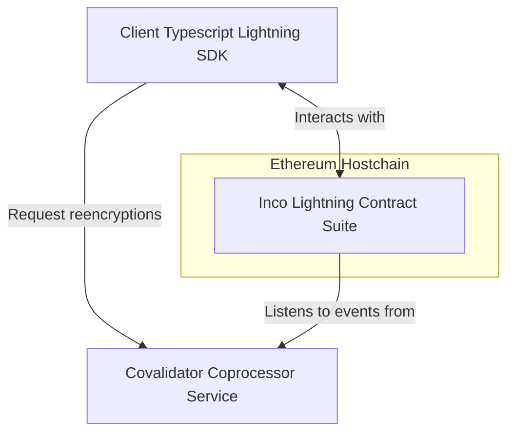

# Inco Lightning

Inco Lighting is a protocol for computing over confidential values on an Ethereum chain. This describes how to interact with confidentiality-enable smart contracts using the [Inco JS SDK](https://www.npmjs.com/package/@inco/js).

With Inco Lighting you can compute over encrypted values without ever revealing them publicly. Later, the results of these computations can be revealed publicly via on-chain _decryption_ or requested privately to permitted users via off-chain _reencryption_.

Below ee provide a brief overview of the Inco Lightning architecture, then we describe how to write a client application that interacts with the Inco Lightning contract suite and the covalidator coprocessor service.

Further details of our architecture can be found at our [Concepts Guide](https://docs.inco.org/guide/intro).

## Overview

Our system consist of three components:

1. The Ethereum host chain on which our protocol contracts are deployed and which maintains global state and consensus
2. Our Inco Lighting protocol contract that provides functions for encrypted computation and public decrytpion
3. Our Covalidator network that listens to Ethereum event, performs private computation, maintains a ciphertext store, and provides APIs for reencryption
4. Our Inco JS SDK that provides functionality for encrypted inputs and decrypting outputs via reencryption to expose private values belonging to a use privately

The process for developing a dapp with confidential compute is as follows:

**Provide a confidentiality-enable smart contract**

- Write a smart contract that binds with the [Inco Lib](../node_modules/@inco/lightning/src/Lib.sol) smart contract accept encrypted inputs and compute over encrypted values
- Deploy that smart contract to an Ethereum chain (currently our testnet contract on Base Sepolia)

**Write a client application**

- Write a client-side Javascript/Typescript application using the Inco JS SDK
- Bind this application to the correct Covalidator servicing the Inco Lightning contract suite
- Interact with the contract using standard Ethereum tooling such as [Viem](https://viem.sh/)

**Compute over encrypted values**

- We can use the Inco JS SDK to send user-provided inputs as encrypted values
- The contract may perform compute on-chain with standard Solidity function calls into our library mixed with ordinary Solidity logic and state
- Values are manipulated via immutable refer

**Reveal values via on-chain decryption**
- A dapp contract may request a decryption of a handle via an on-chain decryption request. Our covalidators will process this request via an Etheruem event and post the decrypted plaintext back on chain

**Access values by off-chain reencryption**
- A user that is permitted to access an encrypted handle to a value (mediated by an on-chain access control contract) is able to obtain the decrypted value corresponding to the handle off-chain via a bilateral interaction with our covalidators.

